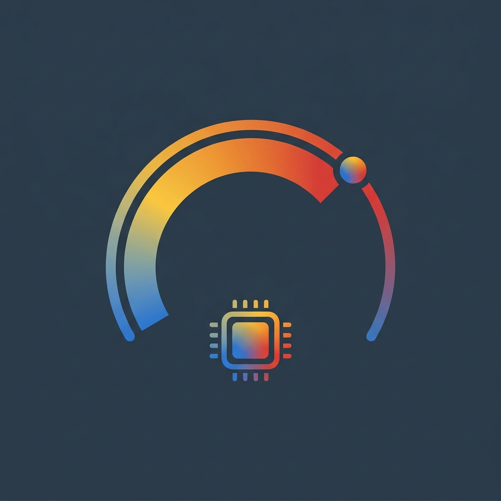

<p align="center">
  
</p>

<h1 align="center">tacho</h1>

<p align="center">
  <strong>Native macOS desktop utility and Dynamic Island HUD for real-time AI quota and session monitoring</strong><br>
  <span>Supporting Claude Code, Antigravity, and Codex CLI</span>
</p>

---

## Overview

`tacho` displays real-time quota consumption and active session states across two interface formats:
1. A desktop widget with adjustable window levels and 4 selectable layout modes.
2. A Dynamic Island panel that expands from the display notch on pointer hover.

---

## Features

### Supported AI Providers
- **Claude Code**: Monitors 5-hour rolling session limits and 7-day weekly quotas as percentage consumed.
- **Antigravity**: Monitors 5-hour rolling session limits and 7-day weekly quotas as percentage available through live Google API synchronization.
- **Codex CLI**: Monitors 5-hour rolling windows and plan quotas as percentage consumed with local process tracking.

### 4 Selectable Display Modes
- **Standard**: Detailed dual-row progress bars with reset countdown timers (`350 pt × 152 pt`).
- **Compact Inline**: Single-line horizontal rows with side-by-side micro-bars (`260 pt × 80 pt`).
- **Micro Stack**: Ultra-narrow vertical layout designed for screen corners (`195 pt × 126 pt`).
- **Hover Expand**: Displays in Compact Inline mode by default; expands to Standard mode on pointer hover.

### Display Notch Integration
- Expands automatically when the pointer enters the display notch area.
- Supports multi-display configurations and updates dynamically when displays connect or disconnect.
- Remains hidden when inactive.

### Provider Management Window
- Configure active providers via a dedicated settings window (`⌘,` or secondary click menu).
- Displays installation status (`Detected` vs `Not Found`) for each supported CLI tool.
- Dynamically resizes the widget and notch dropdown based on the number of enabled providers.

### First-Time Onboarding
- Scans the system on first launch to detect installed AI tools automatically.
- Provides clear, step-by-step guidance for macOS Keychain permissions.

### Real-Time Session Monitoring
- Identifies active command execution, approval prompts, and idle processes.
- Prioritizes actionable states when multiple terminal sessions operate concurrently.
- Uses POSIX system calls to verify process status without background polling overhead.

### Window Management
- **Desktop Level**: Anchors below standard application windows directly above the desktop wallpaper.
- **Floating Level**: Pins above all active application windows.
- Persists window coordinates across system reboots and display reconfiguration.

### System Integration
- Provides a context menu on secondary click (right-click) for configuration.
- Includes a menu bar status item for quick actions.
- Supports automatic launch at system startup.

---

## Technical Specifications

| Parameter | Specification |
|---|---|
| Target Operating System | macOS 13.0 (Ventura) or later |
| Implementation Language | Swift 6.0 |
| UI Framework | SwiftUI / AppKit |
| CPU Utilization (Idle) | 0.0% |
| Memory Footprint | Approximately 20 MB |
| Concurrency Model | Swift 6 MainActor with structured concurrency |

---

## Architecture

| Function | Method | Description |
|---|---|---|
| Provider Protocol | `AIProvider` | Extensible interface contract for AI tool monitoring. |
| Process Detection | `kill(pid, 0)` | Checks process table status for active CLI processes. |
| Lock Monitoring | `flock(fd, LOCK_EX \| LOCK_NB)` | Probes kernel file locks in presence directories. |
| Event Monitoring | `DispatchSourceFileSystemObject` | Receives kernel filesystem events with 80 ms coalescing. |
| Window Leveling | `NSWindow.Level` | Sets window priority to `.desktopIconWindow + 1` or `.floating`. |

---

## Prerequisites

- macOS 13.0 or later
- Xcode 15.0 or later, or Swift 6.0 Command Line Tools

---

## Installation

### Download Pre-built Binary
1. Download `tacho-v0.0.1-macos-arm64.zip` from the [Latest Release](https://github.com/austinatividad/tacho/releases/latest).
2. Extract the archive to obtain `tacho.app`.
3. Move `tacho.app` to `/Applications` and open it.

---

## Build from Source

### Run Directly
```bash
git clone https://github.com/austinatividad/tacho.git
cd tacho
swift run
```

### Build Application Bundle
Execute the packaging script to generate the release application bundle:
```bash
./scripts/bundle-app.sh
```

To open the application:
```bash
open tacho.app
```

To install the application to the system Applications folder:
```bash
cp -r tacho.app /Applications/
```

---

## Directory Structure

```
ai-usage-widget/
├── logo.jpg                          # Official tacho brand mark
├── Package.swift                     # Swift Package Manager manifest
├── scripts/
│   └── bundle-app.sh                 # Application bundling script
├── docs/
│   └── plans/                        # Architectural specifications
├── Sources/
│   ├── main.swift                    # Application entry point
│   ├── Models/
│   │   ├── AIProvider.swift          # Universal AI provider protocol and registry
│   │   ├── UsageData.swift           # Quota data models and display modes
│   │   ├── SessionDetector.swift     # Process and file lock detection
│   │   ├── QuotaService.swift        # Live authenticated quota synchronization
│   │   └── UsageTracker.swift        # Dynamic quota tracker and event monitors
│   ├── Views/
│   │   ├── WidgetView.swift          # Main widget layout and context menu
│   │   ├── NotchIslandView.swift     # Display notch expansion view
│   │   ├── OnboardingView.swift      # Initial setup and provider selection
│   │   ├── ProviderSettingsView.swift# Provider configuration modal window
│   │   ├── UsageProgressBar.swift    # Quota progress bar component
│   │   └── VectorIcons.swift         # Vector icon assets (Claude, AGY, Codex, Tacho)
│   ├── Window/
│   │   └── WidgetWindowManager.swift # Window controller and menu bar item
│   └── Resources/
│       ├── logo.jpg                  # Application logo asset
│       ├── AppIcon.icns              # macOS application icon bundle
│       ├── claude.svg                # Claude vector asset
│       ├── antigravity.svg           # Antigravity vector asset
│       ├── codex.svg                 # Codex vector asset
│       └── codex.png                 # Official Codex app icon asset
└── README.md
```

---

## License

This project is licensed under the MIT License.
